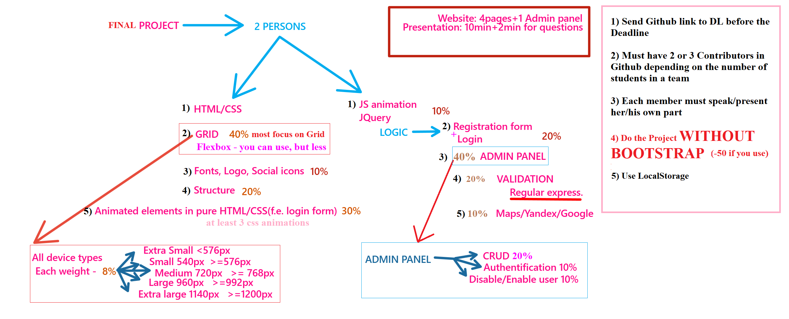
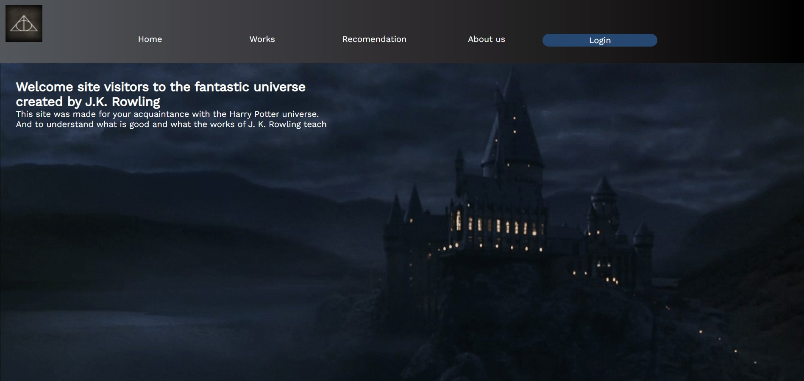
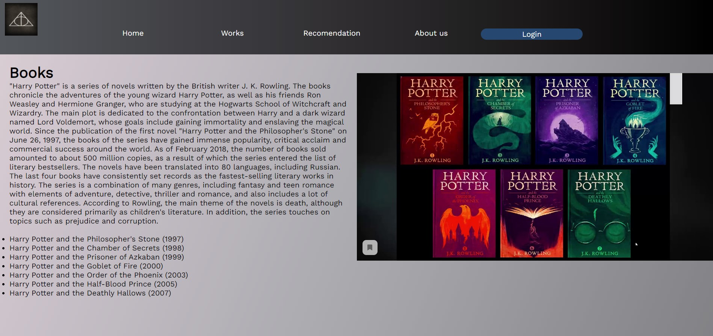
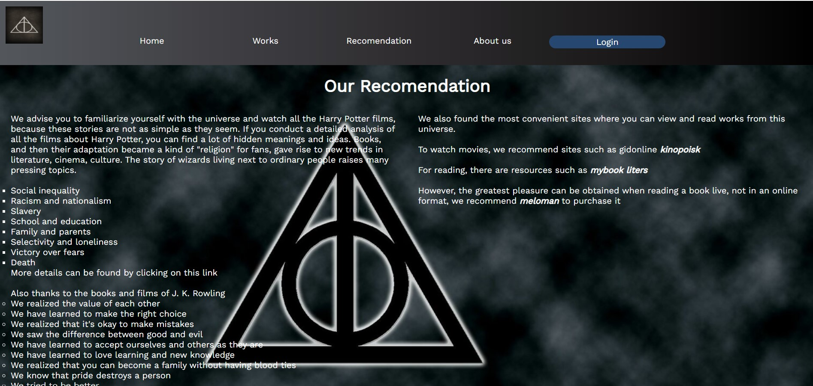

# Final session
## Table of Contents

- Overview
- Challenge 
- Screenshot
- Links 
- My process 
- Built-in 
- What I learned 
- The continued development 
- Useful resources 
- Author 


### Overview
This project was developed and invented for the final exam on the subject of Introduction to Web Development. The project was done as well as possible and enough effort was spent. The project is a website dedicated to the subject of Harry Potter. The site is informative, interesting and also, in our opinion, useful. Useful because Harry Potter books carry a lot of ideas and thoughts. When you get acquainted with the work of J. K. Rowling, you can take a lot for yourself and understand to become better. It also describes many of the problems of our world.

### Challenge
The site must meet the requirements presented below



### Screenshot






### Links
- Live Site URL: (https://espalmaz.github.io/Harry/)


### My process

During the execution of this project, we started working with writing HTML code, as this is the basis on which we worked further. Then after that we made all the necessary changes using CSS. And also, at the end of the work, JAVASCRIPT functions were added.

### Built with

- HTML5 semantic markup
- Custom CSS properties
- CSS Grid Property
- Links to fonts
- Forms with text and a button
-Jquery
-Javascript
-CSS adaptability


### What I learned


In the process of doing this work, we have deepened our knowledge of HTMl, CSS and Javascript. We also studied new functions of these programming languages. In most cases, we improved our skills with these programming languages.

These are examples from our code that are the most successful and new to us:

```html
<div class="almaz">
			<ul style="list-style-type:none;"> 
				<li>Almaz</li>
				<li>Facebook</li>
				<li>Instagram</li>
				<li>VK</li>
				<li>**********</li>
			</ul>
		</div>
		<div class="laura">
			<ul style="list-style-type:none;">
				<li>Laura</li>
				<li>Facebook</li>
				<li>Instagram</li>
				<li>VK</li>
				<li>***********</li>
			</ul>
		</div>
```
```css
.wrapper{
	display: grid;
	grid-template-rows: 600px 70px 200px  ;
  grid-template-columns: 1fr 1fr  ;
  background-image: url(about.jpg);
  color: white;
  animation: bg-animation 25s ease-in-out infinite;
    text-align: center;
    background-repeat: no-repeat;
}
@keyframes bg-animation {
    0% {
        background-size: 320%;
        background-position: 50% 50%
    }
    20% {
        background-size: 350%;
        background-position: 0 50%;
    }    
    40% {
        background-size: 310%;
        background-position: 20% 80%;
    }
    60% {
        background-size: 360%;
        background-position: 60% 10%;
    }
    80% {
        background-size: 320%;
        background-position: 40% 70%;
    }    
    100% {
        background-size: 320%;
        background-position: 50% 50%
    }
}
    }
```
```js
$(document).ready(function() {
$("#forms").validate({
rules: {
username : {
required: true,
minlength: 5,
maxlength: 15
},
email: {
required: true,
email: true
},
password: {
  required: true,
minlength: 6,
maxlength: 12
},
}
});
});
```


### Continued development

In the future, we are going to study various aspects of Javascript, HTML and CSS in more depth in order to add more and more features that will help our site become better. 

### Useful resources

-  (https://www.w3schools.com / - This resource was very useful in writing HTML code, although most of it was written without it, but in some moments it was very useful.
-  (https://www.javascript.com/learn ) - This site also helped a lot in writing Javascript code. Therefore, we recommend that when learning this language, look for information that will help here.

- (https://developer.mozilla.org/ru /) this resource also has a lot of useful articles on various topics , on this site we found answers to some of our questions.
### Authors
Tashimov Almaz and Kiyas Laura
- Website  ( https://espalmaz.github.io/Harry/ )
- Repository ( https://github.com/EspALmaz/Harry.git )
